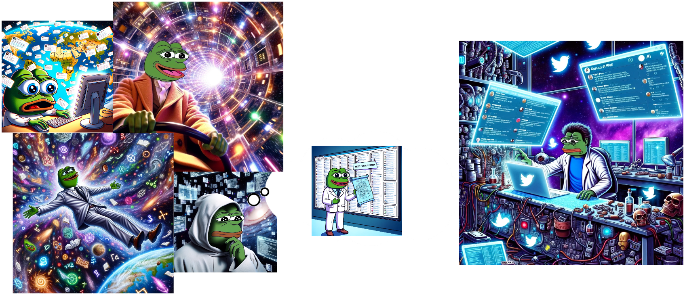

- finish creating the script 
- build a classifier: i want to organize my liked tweets in a few categories. see . 
> this is going to be an iterative process of trying to go from simple to more complex ways of classificaition.  

> __issues:__ what if tweet has no text or the text is referring to an embedded tweet, image or video. see: [shit's going to have to be multimodal??](https://twitter.com/mayfer/status/1704989552459579398)

https://arxiv.org/pdf/2209.09824.pdf

This is a sentence with superscript^text^.

__a story in four parts:__

__part 5:__

but he then realizes he needs tools to separate the noise from the signal. he needs memetic defences. cognitive security. 